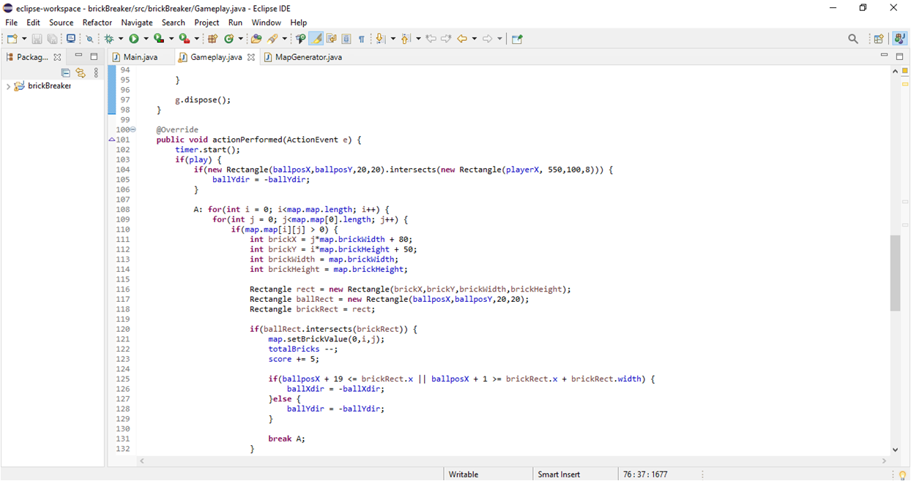
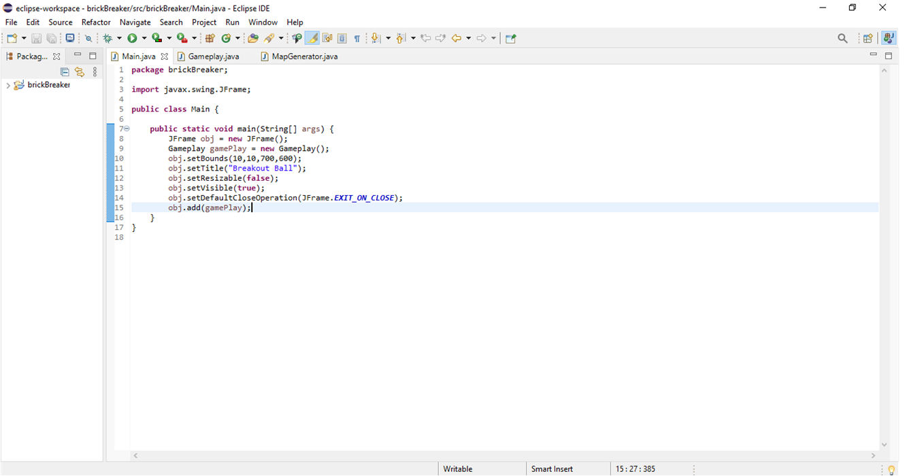
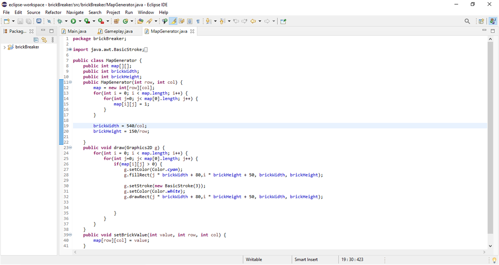

# OOPfinal
#Description
###This a Brick Breaker game, here the player must smash a wall of bricks by deflecting a bouncing ball with a paddle. The paddle may move horizontally and is controlled with the left and right arrow keys. The player lose and game is over , if the ball hits the bottom of the screen. When all the bricks have been destroyed, the player wins. 
###This project done with a help of video tutorial. Thanks a lot!

#Link to the YOUTUBE video tutorial
https://youtu.be/K9qMm3JbOH0

#TOOLS
###Java
###Eclipse

#SCREENSHOTS

